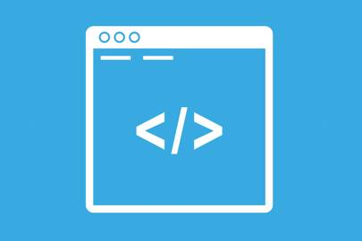

# Package-Helpers #

`API` responsável por ajudar, e facilitar o desenvolvimento. 

 


## isEmail ##
----------------------------------------------
O método __isEmail__ é reponsável por verificar se o dado é um email válido. 

> isEmail(string);

> return boolean
----------------------------------------------

## isNotNull ##
-----------------------------------------------
O método __isNotNull__ é reponsável por verificar se o dado não é null. 

> isNotNull(all);

> return boolean
----------------------------------------------

## testLength ##
-----------------------------------------------
O método __testLength__ é reponsável por verificar se o dado possui um minímo e um máximo de caracteres. 

> testLength(json);

```js
json ({
    data.min `int`,
    data.max `int`
});
```

> return boolean  
----------------------------------------------

# Diponível em: #
-------------------------------------------------
[GitHub]
(https://github.com/JulioPaiva/package-helpers)

[NPM]
(https://www.npmjs.com/package/packge-helpers)

[Git]
(https://github.com/JulioPaiva/package-helpers.git)

----------------------------------------------

### Pré-Requisitos ###
* Install [Node.js](https://nodejs.org)
* Install [npm](https://www.npmjs.com/)

```bash
npm i packge-helpers
```
----------------------------------------------

## Author
[Júlio Paiva]
(julio.paiva@clickqi.com.br)
(juliopaiva.ti@hotmail.com)

----------------------------------------------
